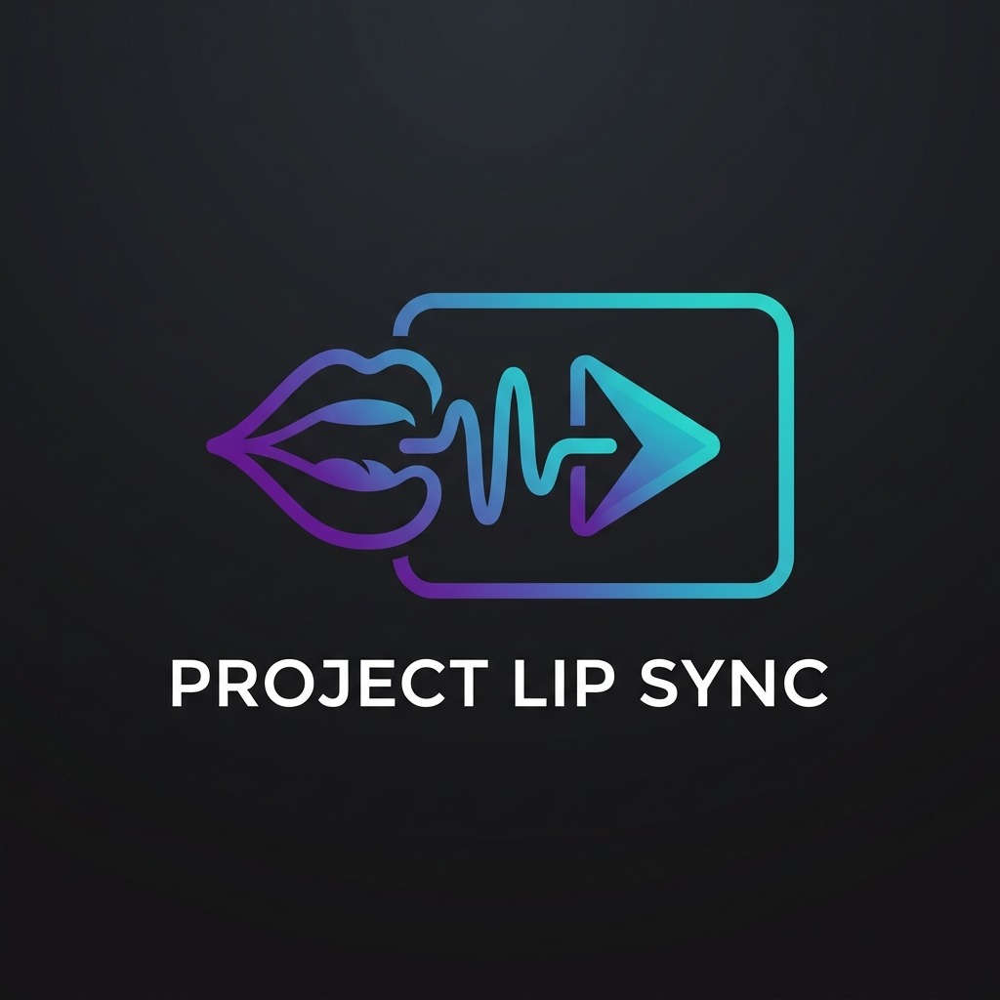

<p align="center">
  
</p>

# Project Lip Sync

Project Lip Sync is a web tool designed to translate and dub English lectures into Bangla. 

It fetches the transcript of a YouTube video, translates the captions using the Claude API, generates spoken audio in Bangla, and merges the new audio back into the original video with correct timing.

## What it does

- **Caption Translation:** Retrieves English subtitles from a YouTube URL and translates them into Bangla using Anthropic's Claude models.
- **Bangla Dubbing:** Converts the translated text into spoken Bangla audio using Microsoft Edge TTS.
- **Audio Mixing & Video Muxing:** Stretches and aligns the generated audio segments to match the original video timing, downloading the video using `yt-dlp` and mixing it with the new audio track using `ffmpeg`.
- **Dual Playback Web Player:** Provides a web interface to play the YouTube video with real-time Bangla subtitles, toggle between original English audio and the Bangla dub, and download the finished dubbed video.

## Prerequisites

To run this project, you need:
- **Python 3.10+**
- **FFmpeg** installed on your system and available in your command line path.
- **Anthropic API Key** (for translation).

## Setup & Installation

1. Clone the repository:
   ```bash
   git clone <your-repo-url>
   cd project-lip-sync
   ```

2. Create a virtual environment and activate it:
   ```bash
   python -m venv .venv
   source .venv/bin/activate  # On Windows: .venv\Scripts\activate
   ```

3. Install the dependencies:
   ```bash
   pip install -r requirements.txt
   ```

4. Create a `.env` file in the root directory (you can copy `.env.example` as a starting point) and add your keys:
   ```env
   ANTHROPIC_API_KEY=your_anthropic_api_key
   ANTHROPIC_MODEL=claude-haiku-4-5
   ```

## Running the App

1. Start the FastAPI server:
   ```bash
   uvicorn main:app --reload
   ```

2. Open your browser and navigate to:
   ```
   http://127.0.0.1:8000
   ```

3. Paste a YouTube URL with English subtitles and click **Translate** to start.
